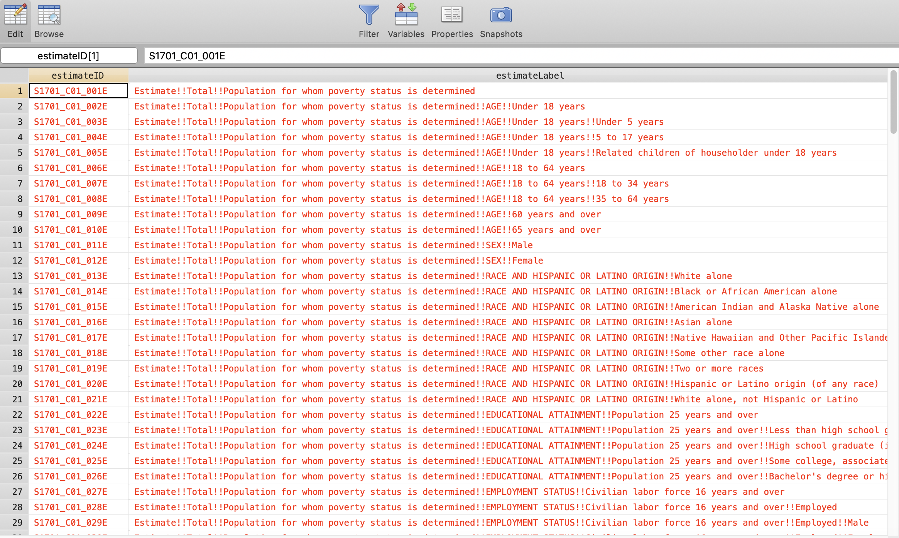
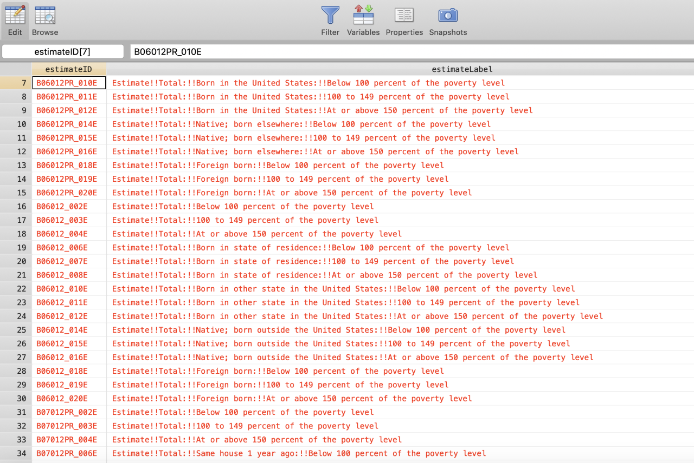

```{r initialize-statamarkdown, echo=FALSE, message=FALSE}
#install.packages("usethis")
#install.packages("rlang")
#install.packages("devtools")
#devtools::install_github("hadley/devtools")
#devtools::install_github("Hemken/Statamarkdown")
library(Statamarkdown)
```


```{r setup, include=FALSE}
knitr::opts_chunk$set(collectcode=TRUE, #include=TRUE,
                      # comment out the line below to execute Stata code
                      # eval=FALSE, 
                      savedo=TRUE)
                      
options(knitr.kable.NA = "")
```

```{stata render-setup, include=FALSE, savedo=FALSE}
set rmsg off
set more off
set linesize 100
```
```{r include=FALSE}
colorize <- function(x, color) {
  if (knitr::is_latex_output()) {
    sprintf("\\textcolor{%s}{%s}", color, x)
  } else if (knitr::is_html_output()) {
    sprintf("<span style='color: %s;'>%s</span>", color, 
      x)
  } else x
}
```

# Project description

The U.S. Census Bureau's American Community Survey (ACS) collects detailed information on the U.S. population, including demographic, economic, and housing characteristics.The most popular way to access ACS data is by visiting [data.census.gov](https://urldefense.com/v3/__https://data.census.gov/cedsci/__;!!OXx53w!i2TZsPKO-ScPdcAVsWVEAcLbthvfwgHT-CqwJZkfThdkZgSQVoZb2pNYmJydcuY$ ), the successor to the Census's American FactFinder website. While these web tools are invaluable for browsing, they can be cumbersome for retrieving data at scale. That's why Census data users who need to obtain data for many years or geographies, or who need many estimates from multiple tables, often rely on the Census Bureau's [Application Programming Interface (API)](https://urldefense.com/v3/__https://www.census.gov/data/developers/updates/new-discovery-tool.html__;!!OXx53w!i2TZsPKO-ScPdcAVsWVEAcLbthvfwgHT-CqwJZkfThdkZgSQVoZb2pNYulsMBlE$ ). In simple terms, data users use the Census API to query to the Census's databases, and the Census Bureau server sends the requested data back to the user. In this project, we will familiarize ourselves with two packages allowing us to work with the Census API:

* `getcensus` (Stata package, created by CBPP)

* `tidycensus` (R package, developed by Kyle Walker and Matt Herman)

# getcensus

Composing API data queries and transforming the returned data into an easy-to-use format can be tricky. That's why the [Center on Budget and Policy Priorities](https://www.cbpp.org/) has developed `getcensus`, a Stata program to help policy analysts obtain ACS tables and portions of tables through the Census API. With `getcensus`, Stata users can easily compose API queries, retrieve data fast, and import it into Stata or Excel, ready for analysis[^1].

[^1]: `getcensus` uses the Census Bureau Data API but is not endorsed or certified by the Census Bureau.

## Installing getcensus

To install getcensus run these two commands (you only need to run them once):

```{stata eval=FALSE}
net install getcensus, from("https://urldefense.com/v3/__https://raw.githubusercontent.com/CenterOnBudget/getcensus/master/src__;!!OXx53w!i2TZsPKO-ScPdcAVsWVEAcLbthvfwgHT-CqwJZkfThdkZgSQVoZb2pNYwikb0tk$ ") replace
ssc install jsonio
```

> Note: getcensus requires Stata version 14.0 or later.

To update `getcensus` run:

```{stata eval=FALSE}
ado update getcensus
```

To use the Census API, you'll need an API key, which you can acquire [here](https://urldefense.com/v3/__https://api.census.gov/data/key_signup.html__;!!OXx53w!i2TZsPKO-ScPdcAVsWVEAcLbthvfwgHT-CqwJZkfThdkZgSQVoZb2pNYipN43Rg$ ).

Next, you will need to direct the `getcensus` program to your API key. You can accomplish this one of two ways:

* Add `global censuskey "YOUR_KEY_HERE"` to your Stata **profile.do** file (recommended). Learn about where to find this file [here](https://urldefense.com/v3/__https://www.stata.com/support/faqs/programming/profile-do-file/__;!!OXx53w!i2TZsPKO-ScPdcAVsWVEAcLbthvfwgHT-CqwJZkfThdkZgSQVoZb2pNYiY8YxDk$ ). This only needs to be done *once*.

* Include `global censuskey "YOUR_KEY_HERE"` at the top of *every* .do file using `getcensus`.

  Example:

  ```{stata eval=FALSE}
  global censuskey "36552GYYYF66688266TTTT7777733366638hhhhhyyfd"
  ```

## Searching for variables 

To retreive data from the Census API, users must supply the table or estimate *ID*. For instance, the table ID of "Poverty Status in the Past 12 Months" is `S1701` and the estimate ID of "Population for whom poverty status is determined" is `S1701_C01_001E`.

Few users know offhand the table number or estimate ID for the data they're interested in. One option is to search for a topic on [data.census.gov](https://urldefense.com/v3/__https://data.census.gov/cedsci/__;!!OXx53w!i2TZsPKO-ScPdcAVsWVEAcLbthvfwgHT-CqwJZkfThdkZgSQVoZb2pNYmJydcuY$ ), find a table of interest, and locate the Table ID. 

A more convenient option is to use the getcensus data dictionary search mode. The getcensus catalog sub-program allows users to search the API data dictionaries from within Stata.

There are two ways to search:

* Insert a table ID between the parentheses to retreive all the estimate IDs and estimate labels associated with the table.
  ```{stata eval=FALSE}
  getcensus catalog, table(S1701)
  ```
  Now you can examine all of the retrieved IDs and labels using the Data Editor.
  
  
  
* Insert a search term, such as "income" or "Hispanic" to find all estimate IDs whose labels contain the search term.

  ```{stata eval=FALSE}
  getcensus catalog, search(poverty)
  ```
  

  You can see that the table IDs have changed. This is because, by default, the program searches the detailed tables. If you want to search other table types, make sure to use the `product` option. For instance, to search for the subject tables run:
  
  ```{stata eval=FALSE}
  getcensus catalog, search(poverty) product(ST)
  ```
  
## Basic syntax

```{stata eval=FALSE}
getcensus [estimate IDs, table ID, or keyword] [, options]
```

**Some useful options include:**

* `years`: Year(s) of data to retrieve.
* `geography`: Geography to download. Default is state.
* `geoids`: GEOIDs of geography to download.
* `statefips`: Two-digit state FIPS codes for which to download data.

**Example:**

This command will pull 1-year Alabama estimates for the `C17024_001` and `C17024_002` variables for 2010 and 2011 years. We can remove `statefips (1)`, and get data for all od the states. We can also add more columns of interest or years, or to switch to 5-years estimates by specifying `data(5)`.

```{stata eval=FALSE}
getcensus C17024_001 C17024_002, years(2010 2011) data(1) statefips (1)
```

> Note: 1-year ACS estimates are only available for 2005 and later. 5-year ACS estimates are only available for 2009 and later.

FIPS codes for the 50 states, District of Columbia, and Puerto Rico are listed [here](https://urldefense.com/v3/__https://www.census.gov/library/reference/code-lists/ansi/ansi-codes-for-states.html__;!!OXx53w!i2TZsPKO-ScPdcAVsWVEAcLbthvfwgHT-CqwJZkfThdkZgSQVoZb2pNY0XqppUA$ ). GEOIDs for counties, places, and other geographies can be found [here](https://urldefense.com/v3/__https://www.census.gov/geographies/reference-files/2018/demo/popest/2018-fips.html__;!!OXx53w!i2TZsPKO-ScPdcAVsWVEAcLbthvfwgHT-CqwJZkfThdkZgSQVoZb2pNYUdy_zmk$ ).

# tidycensus

The tidycensus R package wraps the ACS APIs, allowing R users to access Census data directly.

First, we need to install the required packages and load the libraries:

```{r, eval = FALSE, message=FALSE, warning=FALSE, results="hide"}
install.packages('tidyverse')
install.packages('tidycensus')
```

```{r, eval = TRUE, message=FALSE, warning=FALSE, results="hide"}
library(tidyverse)
library(tidycensus)
```
Next, users should set their Census API key:

```{r eval=FALSE, include=FALSE}
census_api_key("pasteyourkeyhere", install = TRUE)
```

## Searching for variables

To rapidly search for variables, use the load_variables() function. The function takes two required arguments: the year of the Census or endyear of the ACS sample, and the dataset - one of `sf1`, `sf3`, `acs1`, `acs3`, `acs5`, `acs1/profile`, `acs3/profile`, `acs5/profile`, `acs1/subject`, `acs3/subject`, or `acs5/subject`. There is also the optional `cache` parameter that allows users to store the variables dataset on their computer to speed up future browsing.

```{r}
columns_names <- load_variables(year= 2010, dataset = "sf1", cache = TRUE)
```

You can use the `View()` function in RStudio to interactively browse for variables.

```{r eval=FALSE, results='hide'}
View(columns_names)
```

## Basic syntax

Let's say we are interested in these three variables:

* `B19013_001`: Median household income
* `B17001_001`: Poverty universe
* `B17001_002`: In poverty

To pull the data we need to save the variable IDs to a variable:

```{r}
vars <- c("B19013_001", "B17001_001", "B17001_002")
```

Let's now pull 1-year estimates for these variables using 2018 data:

```{r echo=TRUE, message=FALSE, warning=FALSE, results="hide"}
acs_data <- get_acs(
  geography = "state",
  variables = vars,
  year = 2018,
  survey = "acs1",
  show_call = TRUE
)
```

If we want our dataframe to be in the wide form, we can specify `output = "wide"`:

```{r}
acs_data <- get_acs(
  geography = "state",
  variables = vars,
  year = 2018,
  survey = "acs1",
  output = "wide",
  show_call = TRUE
)

acs_data
```

Check data reliability with CVs:

```{r eval=FALSE, message=FALSE, warning=FALSE}
acs_data %>%
  mutate(
    se = moe / 1.645,
    cv = se / estimate,
    reliable = cv < 0.1
  ) %>%
  count(reliable) 
```


